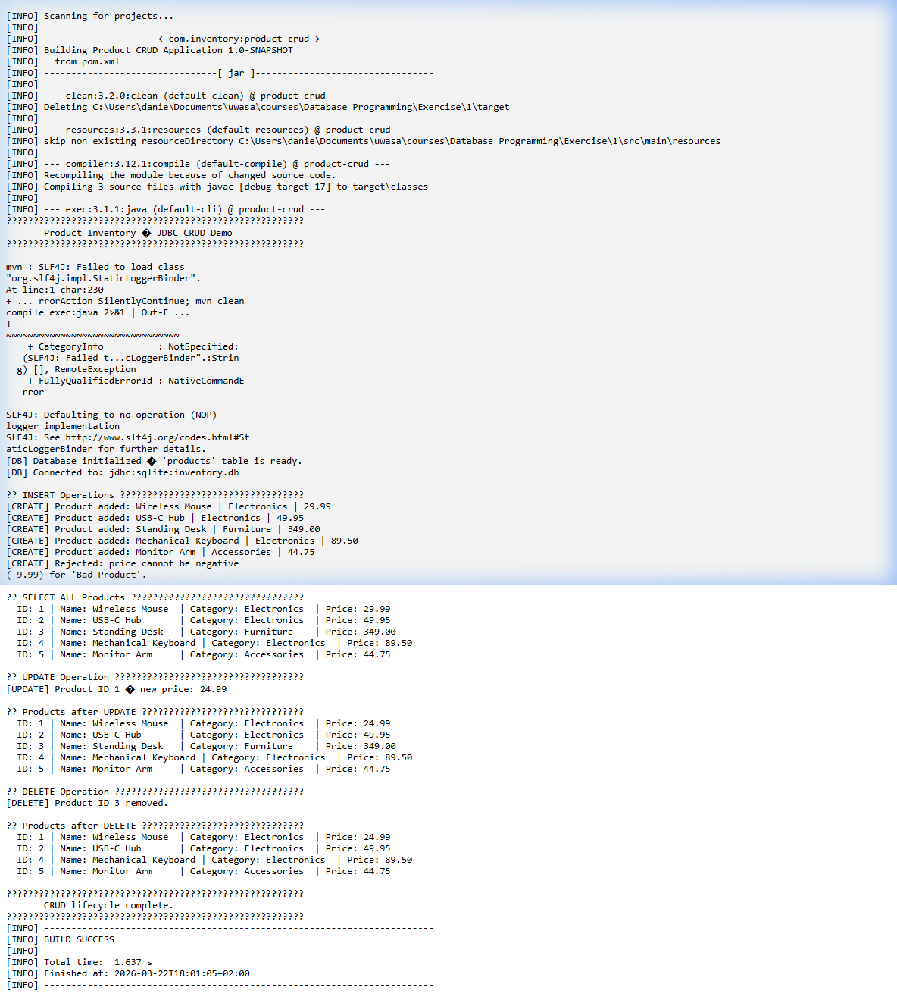

# Database Programming: Exercise 1 Report
**Topic:** JDBC CRUD Operations with SQLite
**Student Name:** Daniel Ebrahimzadeh
**Course:** Database Programming, University of Vaasa

---

## 1. Project Overview & the `products` Table

This project demonstrates a complete lifecycle of Java Database Connectivity (JDBC) operations—Create, Read, Update, and Delete (CRUD)—using a local embedded SQLite database. 

### Why the `products` Table?
In virtually any commercial, retail, or warehouse scenario, tracking inventory is the most critical operational requirement. The `products` table was chosen because it cleanly models a real-world entity with a variety of fundamental data types suitable for a JDBC exercise:

| Column | Data Type | Constraint | Rationale for Inventory Management |
| :--- | :--- | :--- | :--- |
| `id` | `INTEGER` | `PRIMARY KEY AUTOINCREMENT` | A unique identifier is required to accurately target specific items for updates or deletions without ambiguity. |
| `name` | `TEXT` | `NOT NULL` | The human-readable identifier of the item. |
| `category` | `TEXT` | `NOT NULL` | Allows for logical grouping and future aggregation operations (e.g., finding the total value of 'Electronics'). |
| `price` | `REAL` | `NOT NULL` | Represents the monetary value of the item, necessitating precision handling in Java (`double`) and validation constraints (e.g., price >= 0). |

By keeping the schema focused on these four columns, the project isolates and highlights the mechanics of JDBC operations without getting bogged down in complex table joins, while remaining entirely relevant to a realistic inventory management context.

---

## 2. Technical Challenges & Solutions

Developing this application presented several standard database programming challenges, which were addressed using modern Java best practices and tooling.

### Challenge 1: JDBC Driver Deployment & Dependency Management
**The Problem:** Traditional database programming often required manually downloading the vendor-specific JDBC driver `.jar` file (e.g., `sqlite-jdbc.jar`), manually copying it into the project folder, and painstakingly configuring the IDE's classpath. This approach is error-prone and makes sharing the project across different machines or team members difficult, as the absolute paths to the `.jar` files invariably break.
**The Solution:** The project was structured using **Maven**. By defining the project in a `pom.xml` file and specifying `org.xerial:sqlite-jdbc` as a dependency, Maven automatically handles the downloading, caching, and classpath injection of the correct driver version. The project is now entirely portable; running `mvn compile` on any machine will successfully resolve the required JDBC driver. 

### Challenge 2: Resource Leaks and Connection Management
**The Problem:** Database connections, `Statement` objects, and `ResultSet` objects reserve significant resources, including network sockets and file locks (especially critical in SQLite). Failing to explicitly close these objects causes memory leaks and file system locks. Historically, this meant writing verbose `try-catch-finally` blocks where the `finally` block itself required nested `try-catch` blocks to close the resources securely.
**The Solution:** The codebase utilizes Java's **`try-with-resources`** statement introduced in Java 7. By declaring the `Connection`, `PreparedStatement`, and `ResultSet` objects within the `try` parentheses, the JVM guarantees that the `close()` method is automatically called on these resources at the end of the block, regardless of whether the operations succeed or throw an `SQLException`.

### Challenge 3: Security & Data Integrity (SQL Injection)
**The Problem:** Dynamically building SQL queries by concatenating strings (e.g., `"INSERT INTO products VALUES ('" + userInput + "')"`) leaves the database highly vulnerable to SQL injection attacks and makes handling special characters (like apostrophes) tedious. Additionally, there's a risk of corrupting the integrity of the data by inserting impossible values (like negative prices).
**The Solution:** 
1. **Prepared Statements:** The `ProductDAO` exclusively uses `PreparedStatement` with parameterized queries (`?`). User inputs are safely bound using typed setters (`setString()`, `setDouble()`), which automatically escape malicious input and handle data type conversions safely.
2. **Business Logic Validation:** Pre-execution validation was implemented directly in the DAO to reject invalid states before database interaction occurs. For example, the `createProduct` and `updateProductPrice` methods verify that the `price` parameter is strictly non-negative (`price >= 0`), rejecting the operation and outputting an error message if it is not.

---

## 3. Execution & Validation

The `Main.java` class orchestrates the complete CRUD workflow:
1. **Initialize:** Connects to `inventory.db` and ensures the `products` table exists.
2. **Create:** Inserts 5 valid products and tests the validation logic by attempting to insert a product with a negative price (which is correctly rejected).
3. **Read:** Selects and prints all current inventory.
4. **Update:** Modifies the price of Product ID 1.
5. **Delete:** Removes Product ID 3 from the database.
6. **Final Read:** Selects and prints the inventory to confirm the update and deletion were successful.

### Console Output Evidence

A screenshot of the successful compilation, execution, and validation of the application. 
Note the rejection of the invalid negative price and the correct execution of the subsequent updates and deletions.

---
*End of Report*
